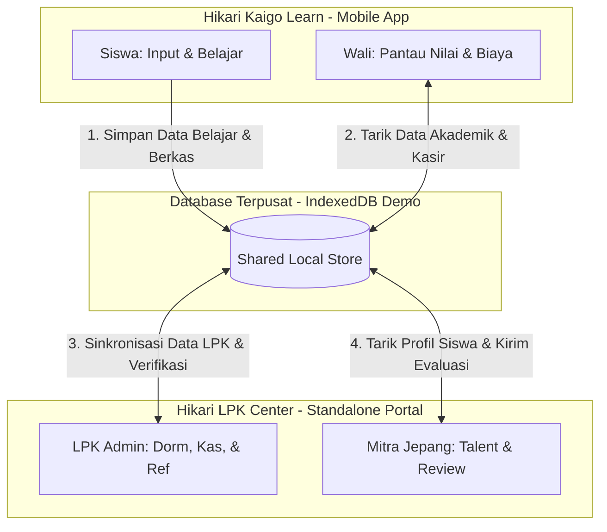

# Rencana Arsitektur & Implementasi: Pemisahan Aplikasi Berdasarkan Karakteristik Perangkat (Revisi Akhir)

Rencana ini merinci pembagian sistem menjadi dua proyek terpisah berdasarkan karakteristik perangkat target pengguna (**Mobile-First** untuk Siswa & Orang Tua, dan **Desktop-First** untuk LPK & Perusahaan Mitra).

---

## 📱 Proyek 1: Hikari Kaigo Learn (Aplikasi Mobile Siswa & Wali)
*   **Folder:** Proyek saat ini (`c:\MARCHEL FILES\ANTIGRAVITY\PARROLINGO`)
*   **Target Perangkat:** Handphone / Mobile Viewport (PWA)
*   **Aktor Pengguna:**
    1.  **Siswa (Peserta):** Belajar harian, latihan shadowing, scan kosakata, upload dokumen keberangkatan, memantau cicilan dana talangan.
    2.  **Orang Tua (Wali):** Desain ultra-sederhana (font besar, kontras tinggi). Memantau kehadiran anak, grafik nilai, linimasa visa, dan notifikasi kedatangan pesawat.
*   **Pendekatan UX:**
    *   Karena Orang Tua memantau melalui HP (dan seringkali menggunakan HP milik anak mereka untuk mengecek), kita menaruh **Portal Wali** di dalam aplikasi mobile siswa ini. 
    *   Cukup klik tombol **"Portal Wali"** di profil siswa atau masuk via nomor telepon orang tua untuk melihat ringkasan perkembangan tanpa perlu mengunduh aplikasi desktop/terpisah.

---

## 🖥️ Proyek 2: Hikari LPK Center (Standalone Desktop Portal LPK & Mitra)
*   **Folder Baru:** Subfolder `lpk-portal/` (React + Vite)
*   **Target Perangkat:** Desktop / Laptop (dengan fallback responsive mobile)
*   **Aktor Pengguna:**
    1.  **LPK (Owner / Staff):** Mengelola kapasitas asrama, menyetujui dokumen, mengaudit kas keuangan dana talangan, memproses bonus referral, meninjau video penjelasan modul.
    2.  **Perusahaan Penyalur & Tujuan (Mitra Jepang):** Memposting lowongan, pre-screening bakat (mencari siswa, memutar video Jikoshoukai), menandatangani agreement tripartit, dan mengirim evaluasi alumni.
*   **Pendekatan UX:**
    *   Tugas administratif berat memerlukan layar lebar (tabel ledger keuangan, peta visual kamar asrama, dan perbandingan profil pelamar).
    *   Fitur dioptimalkan untuk monitor desktop kantor LPK dan panti lansia di Jepang, dengan navigasi sidebar kiri yang informatif.

---

## 🔄 Alur Komunikasi & Sinkronisasi Lintas Perangkat



## 🎨 Visualisasi Desain Antarmuka (UI Mockups)

### 1. Tampilan Utama Dashboard LPK Admin (Desktop View - Standalone App)
Desain layout monitor lebar untuk Direktur/Owner LPK:
```
+-----------------------------------------------------------------------------+
|  🏫 HIKARI LPK CENTER (Admin)                LPK Tenant: [ LPK Sakura v ]  |
+-----------------------------------------------------------------------------+
|  [Sidebar]  |  [KARTU KAS UTAMA]                                            |
|  - Dashboard|  Total Tagihan: Rp 150M | Dana Talangan: Rp 100M              |
|  - Asrama   |  -----------------------------------------------------------  |
|  - Keuangan |  [PETA VISUAL ASRAMA - Kamar Cempaka]                         |
|  - Pelamar  |  +------------+  +------------+  +------------+  +------------+  |
|  - Referral |  | Ranjang 01 |  | Ranjang 02 |  | Ranjang 03 |  | Ranjang 04 |  |
|  - Video    |  | [Budi U.]  |  | [KOSONG]   |  | [Siti R.]  |  | [KOSONG]   |  |
|             |  +------------+  +------------+  +------------+  +------------+  |
|             |  -----------------------------------------------------------  |
|             |  [TABEL LEDGER cicilan dana talangan siswa]                   |
|             |  Siswa     | Total Kas    | Sisa Dana Talangan | Status       |
|             |  Budi U.   | Rp 15.000.000| Rp 10.000.000      | [ 2/10 Lunas]| |
|             |  Siti R.   | Rp 15.000.000| Rp 0               | [ Lunas ]    | |
|             |  -----------------------------------------------------------  |
|             |  [PENGURUSAN ALUR & AUTO-RELEASE KAMAS]                       |
|             |  Siswa: Budi Utomo -> Tahap 5.3 Penerbangan: [ SELESAI v ]     |
|             |  *(Seketika Ranjang 01 Budi Utomo terbebas menjadi KOSONG)*   |
+-------------+---------------------------------------------------------------+
```
*Tautan berkas gambar mockup:*


### 2. Modul Manajemen Asrama & Ranjang (Dormitory Map)
Denah interaktif kamar asrama LPK:


### 3. Modul Buku Kas, Dana Talangan & Piutang Komisi
Tabel peninjauan detail tagihan siswa, status cicilan dana talangan (potong gaji di Jepang), piutang komisi rekrutmen panti lansia, serta persetujuan referral fee:


### 4. Modul Pendaftaran Calon Siswa (Pre-screening)
Tabel monitoring pendaftar baru yang masuk melalui filter prasyarat (usia, tinggi badan, buta warna):


### 5. Tampilan Layar Siswa (Mobile PWA View)
Desain mobile-first untuk siswa belajar dan memantau status kas:
```
+-----------------------------------+
|  🎒 HIKARI KAIGO LEARN  [Streak: 🔥12] |
+-----------------------------------+
|  [PROGRAM BELAJAR AKTIF]          |
|  Program: [ KAIGO (Caregiver) v ] |
|  - Kurikulum menyesuaikan Kaigo  |
|  -------------------------------  |
|  [VIDEO PERKENALAN JIKOSHOUKAI]   |
|  Link: [ https://youtube.com/.. ] |
|  -------------------------------  |
|  [STATUS KAS & DANA TALANGAN Anda]|
|  Total Sisa Pinjaman: Rp 8.000.000|
|  Cicilan Potong Gaji:             |
|  [Bulan 1: Lunas] [Bulan 2: Lunas]|
|  [Bulan 3: Pending] <-- [Klaim]   |
|  *(Klik Klaim jika sudah dipotong |
|    tapi status belum Lunas)*       |
+-----------------------------------+
|  [ Map ] [ Kamus ] [ Profil ]     |
+-----------------------------------+
```

### 6. Tampilan Layar Orang Tua / Wali (Mobile View)
Informasi ringkas, kontras tinggi, dan mudah dipahami Orang Tua:
```
+-----------------------------------+
|  👨‍👩‍👧 PORTAL WALI - Orang Tua Budi   |
+-----------------------------------+
|  [KEHADIRAN & NILAI ANAK]         |
|  - Kehadiran Belajar: 98% (Baik)  |
|  - Nilai Ujian Uji Coba: 85/100   |
|  -------------------------------  |
|  [RINCIAN KEUANGAN ANAK]          |
|  - Uang LPK Terbayar: Rp 5.000.000|
|  - Sisa Dana Talangan: Rp 10.000M |
|  -------------------------------  |
|  [STATUS TAHAPAN VISA ANAK]       |
|  CoE Jepang : [ ✓ TERBIT ]        |
|  Visa Kedubes: [ Sedang Diproses ]|
|  Penerbangan: [ Menunggu Jadwal ] |
+-----------------------------------+
```

### 7. Tampilan Layar Perusahaan Jepang (Desktop View)
Penjaringan talenta, video screening, dan ulasan kinerja alumni:
```
+-----------------------------------------------------------------------------+
|  🏢 HIKARI LPK CENTER (Mitra Jepang)           Panti: [ Sakura Care Tokyo ] |
+-----------------------------------------------------------------------------+
|  [FILTER TALENT POOL SISWA]                                                 |
|  Program Kerja: [ Kaigo (Caregiver) v ]  Sertifikasi Bahasa: [ N4 / JFT v ]|
|  -------------------------------------------------------------------------  |
|  [DAFTAR SISWA YANG LOLOS SELEKSI LPK]                                      |
|  Kandidat      | Kualifikasi        | Video Jikoshoukai | Aksi              |
|  Eko Prasetyo  | Lulus JFT & SSW    | [ Nonton Video ▶ ]| [ Panggil Mensetsu]|
|  Ratna Sari    | Lulus N4 & SSW     | [ Nonton Video ▶ ]| [ Panggil Mensetsu]|
|  -------------------------------------------------------------------------  |
|  [EVALUASI ALUMNI YANG BEKERJA DI PANTI ANDA]                               |
|  Pilih Pekerja: [ Siti Rahma v ]  Nilai Komunikasi: [ A - Sangat Baik v ]   |
|  Komentar: "Kinerja merawat lansia sangat cekatan dan bahasa lancar."       |
|  [ Kirim Evaluasi Kinerja ]                                                 |
+-----------------------------------------------------------------------------+
```

---

## 📋 Ekspor Rencana PDF / DOCX
Dokumen rencana pemisahan berdasarkan jenis perangkat ini telah diperbarui dalam berkas HTML siap cetak:
📂 **[implementation_plan.html](file:///C:/Users/WELCOME/.gemini/antigravity/brain/ddd34c4e-5a9f-4b91-8f34-f0a14ba2b422/implementation_plan.html)**
*(Buka berkas di atas dan klik tombol cetak untuk menyimpan rencana pemisahan arsitektur ini sebagai berkas PDF).*
